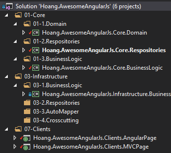
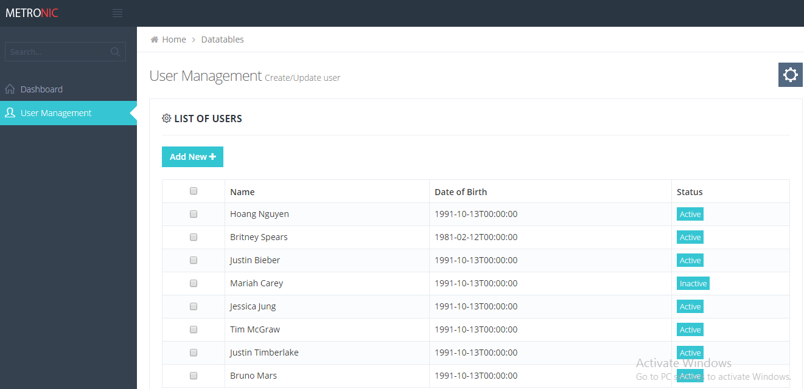

### Hoang Nguyen Manh 
-- Candidate from Vietnam 
-- Email: nguyenmanhhoang91@gmail.com
### Demo: User Management

#### 1. Technologies:
**-- Backend**
+ MVC
+ WebApi

**-- FrontEnd**
+ AngularJs

**-- Library**
+ Autofac for MVC and WebApi
------
For quick demo, I am using Metronic theme for UI:
http://www.keenthemes.com/preview/metronic/

#### 2. Project's Architecture

-- Architecture: *Domain Driven Design*

##### 2.1. Core

###### 2.1.1. Hoang.AwesomeAngularJs.Core.BusinessLogic
-- Business interfaces.

###### 2.1.2. Hoang.AwesomeAngularJs.Core.Domain
-- Domain models.

###### 2.1.3. Hoang.AwesomeAngularJs.Core.Repositories
-- Repository interface.

###### 2.1.4. Hoang.AwesomeAngularJs.Core.Crosscutting
-- Common utils/helper class

##### 2.2. Infrastructure:

###### 2.2.1. Hoang.AwesomeAngularJs.Infrastructure.BusinessLogic
-- Implement business interfaces.
-- For quick demo, I do not apply repository here so I'm using fake data in one of business logic class.

###### 2.2.2. Hoang.AwesomeAngularJs.Infrastructure.Repositories
-- Implement repository interface.

###### 2.2.3. Hoang.AwesomeAngularJs.Infrastructure.AutoMapper
-- Store AutoMapper's profiles which process Mapping between domain models and DTO. 

##### 2.3. Clients

-- Clients shares the same business logics, repositories.
-- Only one feature available: 
- [x] Load list of users. 

###### 2.3.1. Hoang.AwesomeAngularJs.Clients.AngularPage

-- This solution is fully implemented. 
-- Single app page using AngularJs. 
-- Provide Api in the same project.
-- Apply Autofac configuration for reusing business logics.
-- Using AngularJs's default architecture (Module). There are 2 modules: Common (header, footer, sidebar), User Management module.

###### 2.3.2. Hoang.AwesomeAngularJs.Clients.MVCPage
-- Website using ASP.NET MVC. 
-- Views, Controllers are not implemented yet. 
-- Apply Autofac configuration.

##### To be enhanced: 

###### Frontend
- [x] Using modules pattern for ui-router

###### Backend
- [x] Implement "not implemented" projects: (Crosscutting, Repository, ...)
